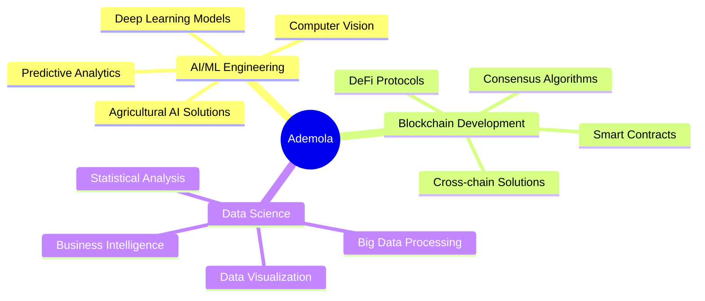

# 🚀 Hi there, I'm Ademola Omisakin! 
### AI/ML Engineer • Blockchain Developer • Data Science Wizard

<div align="center">
  
</div>

<div align="center">
  
[](https://linkedin.com/in/ademola-omisakin)
[](mailto:Aoluwar@gmail.com)
[](https://github.com/aoluwar)


</div>

---

## 🎯 About Me

> **"Transforming complex data into intelligent solutions that drive real-world impact"**

I'm a passionate **AI/ML Engineer** and **Blockchain Developer** based in Lagos, Nigeria, with a proven track record of:
- 🌾 **Improving crop yield predictions by 30%** through advanced ML systems
- ⚡ **Enhancing blockchain energy efficiency by 60%** with custom consensus algorithms  
- 📈 **Boosting client decision-making accuracy by 25%** with predictive models
- 🎯 **Achieving 5-star client ratings** consistently across diverse projects

---

## 🔥 Current Focus

<div align="center">



</div>

---

## 💼 Professional Journey

### 🚀 **Blockchain Engineer** (Contractor) 
*Jan 2023 - Jun 2024*
- 🔐 Built secure smart contracts across **Ethereum & Solana**
- ⚡ Developed custom consensus algorithm improving energy efficiency by **60%**
- 🛡️ Conducted security audits preventing vulnerabilities
- 👥 Mentored junior developers in blockchain best practices

### 🌱 **Machine Learning Engineer** @ GROW
*Feb 2022 - Apr 2023*
- 🎯 Improved crop yield predictions by **30%** using advanced ML
- 🌦️ Built weather prediction model with **85% accuracy**
- 📊 Co-developed AI dashboard increasing platform adoption by **50%**
- 🧪 Optimized algorithms for specific crop types with agronomists

### 📊 **Data Scientist** @ Fiverr (Freelance)
*Oct 2021 - Feb 2022*
- ⭐ Maintained **5-star rating** across all client projects
- 📉 Reduced telecom churn by **15%** with predictive modeling  
- 📈 Improved e-commerce cross-sell revenue by **30%**
- 🎯 Enhanced marketing campaign effectiveness by **40%**

---

## 🛠️ Tech Arsenal

<div align="center">

### **Programming Languages**


### **AI/ML & Data Science**


### **Blockchain & Web3**


### **Databases & Cloud**


</div>

---

## 🏆 Featured Projects

<div align="center">

<table>
<tr>
<td width="50%">

### 🎵 **Apple Music Recommender**
*Jan 2024 - Present*

A real-time music recommendation system with personalized suggestions

**Tech Stack:** Python, ML Algorithms, APIs
- Real-time processing
- Genre-based filtering  
- User preference learning
- Scalable architecture

[🔗 View Project](#)

</td>
<td width="50%">

### 🌾 **Agriculture AI Platform (Cloak)**  
*Jan 2023 - Jun 2024*

AI-powered agricultural solution for crop optimization

**Tech Stack:** Python, Computer Vision, ML
- Disease detection & diagnosis
- Yield prediction models
- 30% improvement in predictions
- Real-time monitoring

[🔗 View Project](#)

</td>
</tr>
</table>

</div>

---

## 📊 GitHub Analytics

<div align="center">
  
<table>
<tr>
<td width="50%">


</td>
<td width="50%">


</td>
</tr>
</table>


</div>

---

## 🎯 Achievement Highlights

<div align="center">

| 🏆 **Achievement** | 📊 **Impact** | 🎯 **Domain** |
|:---|:---|:---|
| Energy Efficiency Boost | **60% Improvement** | Blockchain |
| Crop Yield Predictions | **30% Better Accuracy** | Agriculture AI |
| Client Satisfaction | **5-Star Rating** | Data Science |
| Platform Adoption | **50% Increase** | ML Engineering |
| Churn Reduction | **15% Decrease** | Predictive Analytics |
| Revenue Growth | **30% Cross-sell** | E-commerce ML |

</div>

---

## 🌟 Community Impact

### 📚 **Education & Mentorship**
- 🎓 **Student Ambassador** @ Financial Services Innovation (FSI)
- 💰 **Campus Ambassador** @ Cowrywise - *40% platform engagement boost*
- 👨‍💻 **Coding Instructor** @ Prepsmatter Tutorial Centre
- 🔬 **Physics Tutor** - *25% class performance improvement*
- ⚙️ **IEEE Core Member** - Organized 200+ participant events

---

## 🎨 Fun Facts About Me

<div align="center">

```python
class AdemolaOmisakin:
    def __init__(self):
        self.location = "Lagos, Nigeria 🇳🇬"
        self.education = "Physics @ Obafemi Awolowo University"
        self.interests = [
            "🤖 Building AI that solves real problems",
            "⛓️ Decentralized systems & Web3",
            "📊 Turning data into stories",
            "🌱 AgriTech innovations",
            "🎓 Teaching & mentoring"
        ]
        self.currently_learning = ["Advanced Deep Learning", "DeFi Protocols"]
        self.fun_fact = "I automated maintenance reports saving 10hrs/week! ⚡"
    
    def get_coffee(self):
        return "☕ Fueling the next breakthrough..."
```

</div>

---

## 📈 Contribution Graph

[](https://github.com/aoluwar)

---

## 💬 Let's Connect!

<div align="center">

**Always excited to collaborate on:**
- 🤖 AI/ML Engineering Projects  
- ⛓️ Blockchain & DeFi Development
- 📊 Data Science Solutions
- 🌱 AgriTech & Sustainability
- 🎓 Educational Technology

---


---

**⭐ From [Ademola Omisakin](https://github.com/aoluwar) - Building the future, one algorithm at a time! 🚀**

</div>
